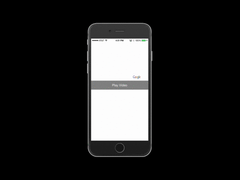

# FormsNativeVideoPlayer

### Video Player for Xamarin Forms
This is a cross-platform solution for playing video using the native video player for each platform.

| Module           | Version | Date |
|------------------|---------|------|
| FormsNativeVideoPlayer |  [1.0.0](CHANGELOG.md)  | 2017/06/20 |

### Sample
This example shows how to play a video from a url link in a Xamarin.Forms application. Screen rotation is enabled to allow full screen, but no other controls were built in to keep this a more basic example. 

Things to note about this sample:  

* Android utilizes multiple layout files  
	* Layout and Layout-land folders utilized
	* Android OS handles the rotation by using the new layout file
	* This technique can be used for any C# native views you want to utilize on Xamarin.Android
* iOS is a simpler solution, but you'll notice a different video was used
	* I was unable to utilize the dropbox link, it seems that Android is a little more robust
* iOS may require certain Http exceptions to allow certain videos to be shown
	* You can view the example [here](https://github.com/xamarin/customer-success-samples/blob/master/samples/Xamarin.Forms/FormsNativeVideoPlayer/iOS/Info.plist#L62)

If you have any questions about this sample, please feel free to open an issue and assign it to the author.

#### Original Author

[Jun 29, 2016](https://github.com/xamarin/customer-success-samples/tree/master/samples/Xamarin.Forms/FormsNativeVideoPlayer)  
Michael Watson  
Customer Success Engineer  
Xamarin.Forms Specialist  
@ThreeBrewMates  

#### Multiple Studio Instances

macOS open multiple Xamarin/Visual Studio instances:

    open -n /Applications/Visual\ Studio.app/  
    open -n /Applications/Xamarin\ Studio.app/  

## Version History

See [CHANGELOG.md](CHANGELOG.md)
